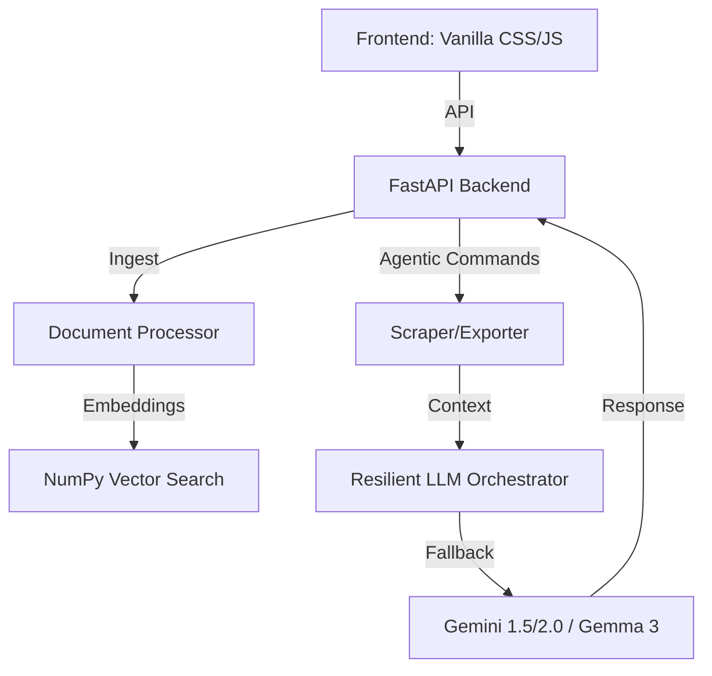

# 🚀 DocuMind AI — Agentic RAG Assistant

DocuMind AI is a production-grade, "Self-Healing" Agentic RAG (Retrieval Augmented Generation) Assistant designed for seamless document intelligence. Built with **FastAPI**, **Google Gemini**, and a custom-engineered **NumPy Vector Index**, it overcomes standard RAG limitations with automated resilience.

---

## 🌟 Key Features

### 🧠 Self-Healing Model Orchestrator
DocuMind AI features a sophisticated **Multi-Model Fallback** system. If a specific Gemini model hits its free-tier quota (429) or is unavailable, the backend automatically and silently shifts the conversation to the next available model (e.g., `Gemini 1.5-Flash` → `Gemini Pro` → `Gemma 3`). 

### 🌐 Portal-Aware Intelligent Scraper
Standard scrapers fail on modern Single Page Applications (SPAs). Our scraper uses **Metadata Fallback** and **Deep Tag Extraction** to successfully "read" sites like `alactic.io` and `wikipedia.org`, even when the main body content is hidden.

### 📄 Universal Document Support
-   **PDF:** High-fidelity text extraction via PyPDF2.
-   **Word (DOCX):** Full support for professional business documents.
-   **Markdown/Text:** Seamless ingestion of codebases and notes.
-   **Web URLs:** Instant agentic scraping into the Knowledge Base.

### 🛰️ Mobile-First Responsive Design
The entire interface has been meticulously optimized for mobile devices. Featuring a **Collapsible Glassmorphism Sidebar**, auto-truncating headers, and fluid chat bubbles, DocuMind AI provides a premium experience on everything from an iPhone to a 4K Desktop.

### 🛡️ Sync-Integrity Guardian
A custom-built **Vector Watchdog** that detects and repairs "ghost data" or desynchronization between the database and the vector index on startup, ensuring 100% stability.

---

## 🛠️ Architecture



---

## 🏃‍♂️ Quick Start (Local)

1. **Backend:**
   ```bash
   cd backend
   pip install -r requirements.txt
   # Add GEMINI_API_KEY to .env
   python main.py
   ```

2. **Frontend:**
   Open `frontend/index.html` in any browser or use a Live Server.

---

## ☁️ Deployment Guide (Unified Strategy)

DocuMind AI is configured as a **Unified Application**—the FastAPI backend serves the frontend static files automatically. This simplifies deployment to a single service.

### 🛡️ Render.com / Railway / Heroku
1.  Link your GitHub repository to your hosting provider.
2.  Environment: `Python 3`.
3.  Build Command: `pip install -r requirements.txt`.
4.  Start Command: `gunicorn backend.main:app -k uvicorn.workers.UvicornWorker` (or see `Procfile`).
5.  Add `GEMINI_API_KEY` to the **Environment Variables**.
6.  The app will be live at your provided URL! No separate frontend deployment needed.

---

## 🏆 Selection Rationale (For Alactic Inc)
DocuMind AI focuses on **Reliability Engineering**. It was built to stay alive during high-pressure demonstrations by handling Rate Limits (429) and Model Availability (404) gracefully. This showcases proactive system design beyond a standard student application.

